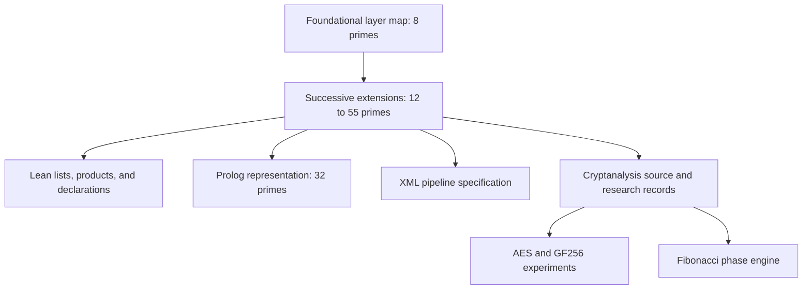

# Sedona Spine

Sedona Spine is a prime-indexed map of the SnapKitty architecture and its research artifacts. Each prime identifies a layer or operator family: hardware starts at `O_2`, quantum substrate at `O_3`, intelligence at `O_5`, and subsequent extensions add formal methods, symbolic law, cryptanalysis, and other domains.

This repository publishes the spine definitions alongside the AES, Möbius-bridge, finite-field, and phase-engine source associated with that research. It preserves selected files from `sovereign-cuda-kernels` as a public prior-art source record, with original authorship, license notices, and extraction hashes.

## Where to start

1. Read the [original layer map](SOVEREIGN_TRUST_MANIFEST.md) for the eight foundational layers.
2. Use the progression table below to follow the extensions through 55 primes.
3. Read the [cryptanalysis paper](AHMAD_CRYPTANALYSIS_PAPER.md) with the [AES claim registry](AES_CLAIM_REGISTRY.md) for the research narrative and individual claim records.
4. Open the corresponding Python or Lean file to inspect the implementation or formal statement.

## How the spine is represented

The notation `O_p` assigns an operator family to prime `p`. For example, the manifest associates `O_11` with cycle stealing and `O_13` with parameter security. The mapping connects architectural descriptions to source families and language roles.

The repository contains several representations of that map:

- **Markdown manifests** describe layers, language families, and artifact locations.
- **Lean source** defines prime lists, products, mathematical objects, and theorem statements for successive extensions.
- **Prolog source** records the 32-prime list and symbolic-law predicates.
- **XML** places the layers and research modules in the larger pipeline specification.



This diagram is a reading map of the artifacts. The source relationships are described in the manifests and individual files.

### Foundational layers

| Prime | Layer | Role in the original map |
| --- | --- | --- |
| 2 | Hardware root | ROM, boot, and hardware sources |
| 3 | Quantum substrate | Quantum Euclid, Taylor, and search sources |
| 5 | MoE intelligence | Routing and cognitive-stack sources |
| 7 | Classical scaling | Multiplicity and scaling sources |
| 11 | Cycle stealing | DMA and scheduling-related hardware |
| 13 | Parameter security | Security and cryptographic sources |
| 17 | Dream consolidation | Consolidation and cognitive-stack sources |
| 19 | Adaptive learning | Adaptive cognitive-stack behavior |

The [language mapping](IP_TRUST_PROTOCOL.md) connects these roles and later layers to assembly, CUDA, Python, Fortran, Lean, Haskell, Rust, and other languages. Some referenced implementations remain in the original repository; this extraction contains the files listed below.

### Progression through 55 primes

| Sequence | Added subject area | Definition source |
| --- | --- | --- |
| 8 primes, 2–19 | Foundational architecture | [Trust manifest](SOVEREIGN_TRUST_MANIFEST.md) |
| 12 primes, 2–37 | Jordan, LiquidLean, WORM, art | [Parr papers](kernels/lean4/parr-papers/Parr_Papers_Formalized_v2026.lean) |
| 18 primes, 2–61 | Quantum artificial life | [QAL](kernels/lean4/qal/QAL_Formalized_v2026.lean) |
| 25 primes, 2–97 | HyperKitty DSL, tripartite structure, JWT, NAND | [HK-DSL](kernels/lean4/hkdsl/HK_DSL_Formalized_v2026.lean), [tripartite definitions](kernels/lean4/HK_DSL_Tripartite.lean) |
| 32 primes, 2–131 | Proof and witness language roles | [Witness stack](kernels/lean4/proofs/SnapKitty_Proofs_Witness_Stack_v2026.lean) |
| 44 primes, 2–193 | Boole, E7, and GKN extension | [Boole/E7/GKN](kernels/lean4/boole-e7/Boole_E7_GKN_Formalized_v2026.lean) |
| 55 primes, 2–257 | Mythos and cryptanalysis extension | [Mythos](kernels/lean4/mythos/Mythos_Cryptanalysis_Swarm_v2026.lean) |

In the 55-prime source, `all_55_primes` holds the sequence and `prime_seal_55` multiplies its entries. A prime-product seal identifies the selected prime set arithmetically. The SHA-256 hashes in the provenance manifests separately identify the copied file contents.

The [Prolog representation](kernels/proofs/symbolic_law/snapkitty_proofs.pl) exposes `sedona_primes/1`, `prime_seal_32/1`, and `trust_scalar_32/1`. The [pipeline XML](kernels/hyperkitty-pipeline/pipeline_constraint.xml) retains the larger integration context and successive spine extensions.

## Cryptanalysis collection

The AES work is associated with prime 211 in the supplied spine headers. It combines executable experiments, Lean statements, and written result records. The files cover different models and stages of the research; the claim registry provides their accompanying evidence labels.

### AES, finite fields, and Möbius bridge

All files below are in [kernels/cryptanalysis/aes_mobius_bridge](kernels/cryptanalysis/aes_mobius_bridge/).

| File | What readers will find |
| --- | --- |
| [aes_algebraic_structure.py](kernels/cryptanalysis/aes_mobius_bridge/aes_algebraic_structure.py) | GF(2^8) arithmetic, algebraic S-box construction, round operations, binary differentials, and rank calculations. Entry points include `verify_sbox()` and `main()`. |
| [aes_mobius_bridge_attack.py](kernels/cryptanalysis/aes_mobius_bridge/aes_mobius_bridge_attack.py) | The supplied reduced-round bridge model, fingerprint structures, forward-table construction, and attack-result reporting. |
| [gf256_log_gauge.py](kernels/cryptanalysis/aes_mobius_bridge/gf256_log_gauge.py) | A discrete-log quotient over the nonzero elements of GF(256), zero-position tracking, and checks of collapse and discrimination assumptions. |
| [aes_differential_trail_search.py](kernels/cryptanalysis/aes_mobius_bridge/aes_differential_trail_search.py) | A PuLP mixed-integer model using ShiftRows indexing and activity constraints. `solve_and_report(rounds)` solves a chosen round count. |
| [AES_Algebraic_Structure.lean](kernels/cryptanalysis/aes_mobius_bridge/AES_Algebraic_Structure.lean) | Formal declarations accompanying the algebraic study. |
| [AES_Mobius_Bridge_Theorems.lean](kernels/cryptanalysis/aes_mobius_bridge/AES_Mobius_Bridge_Theorems.lean) | Bridge-related formal statements. |
| [AES_Trail_Invariants.lean](kernels/cryptanalysis/aes_mobius_bridge/AES_Trail_Invariants.lean) | Trail and diffusion-related definitions and statements. |
| [AES_10Round_Terminal_Result.lean](kernels/cryptanalysis/aes_mobius_bridge/AES_10Round_Terminal_Result.lean) | The supplied formal treatment of the full-round terminal analysis. |

The log-gauge file is useful for understanding the research question. For a nonzero four-byte column it computes discrete logarithms modulo 255, subtracts a common gauge derived using `4^-1 = 64 mod 255`, and examines the resulting quotient. Its checks address three questions: whether key-byte variation collapses to a common quotient, how zero values affect the domain, and whether distinct hypotheses remain distinguishable. Its three-round probe explicitly omits ShiftRows and identifies the full cut-point parameterization as further work.

The written records are [TRAIL_RESULTS.md](kernels/cryptanalysis/aes_mobius_bridge/TRAIL_RESULTS.md) and [AES_10ROUND_TERMINAL_RESULT.md](kernels/cryptanalysis/aes_mobius_bridge/AES_10ROUND_TERMINAL_RESULT.md). They preserve the reported results of the original study. The full-round document records a **NO BREAK** outcome for the approaches it discusses.

### Rhythmic Fibonacci phase engine

The [phase-engine directory](kernels/cryptanalysis/phase_engine/) contains:

- [rhythmic_fibonacci_phase.py](kernels/cryptanalysis/phase_engine/rhythmic_fibonacci_phase.py): Fibonacci and Cassini calculations, phase mappings, SU(2) phase gates, state evolution, Bloch coordinates, and Hilbert-dimension comparisons.
- [Rhythmic_Fibonacci_Phase_Engine.lean](kernels/cryptanalysis/phase_engine/Rhythmic_Fibonacci_Phase_Engine.lean): the accompanying formal source.

This branch of the collection connects the number-theoretic phase construction to the source's discussion of state evolution and cycle stealing.

## Reading and running the source

The Python files have direct script entry points. From the repository root:

```sh
python kernels/cryptanalysis/aes_mobius_bridge/aes_algebraic_structure.py
python kernels/cryptanalysis/aes_mobius_bridge/gf256_log_gauge.py
python kernels/cryptanalysis/phase_engine/rhythmic_fibonacci_phase.py
```

The differential-trail script additionally imports PuLP and uses its solver interface:

```sh
python -m pip install pulp
python kernels/cryptanalysis/aes_mobius_bridge/aes_differential_trail_search.py
```

The Lean collection includes both core-only files and Mathlib imports. This source extraction does not include a pinned Lean/Mathlib project or a unified build command. The [AES claim registry](AES_CLAIM_REGISTRY.md) distinguishes computational checks, formal claims, axioms, and open obligations. The copied Lean files retain their original declarations, including assumptions and unfinished obligations where present.

## Research records and provenance

- [AHMAD_CRYPTANALYSIS_PAPER.md](AHMAD_CRYPTANALYSIS_PAPER.md): the cryptanalytic study and its formulations.
- [AES_CLAIM_REGISTRY.md](AES_CLAIM_REGISTRY.md): individual claims, artifact references, and recorded evidence categories.
- [ENCRYPTION_PRIOR_ART_REGISTRY.md](ENCRYPTION_PRIOR_ART_REGISTRY.md): the supplied encryption artifact registry.
- [PROVENANCE.json](PROVENANCE.json): source checkout revision, extraction time, paths, lengths, and SHA-256 hashes for the original 12-file spine extraction.
- [CRYPTOANALYSIS_PROVENANCE.json](CRYPTOANALYSIS_PROVENANCE.json): the same information for the 15-file cryptanalysis addition.

The extraction manifests describe local working-tree copies, with the checkout's Git revision recorded for context. Source dates, authorship, result labels, and sealing statements are preserved as supplied. This repository's Git history records the subsequent publication and documentation changes.

## Authorship and licensing

Original attribution remains in each source file: Jessica / SNAPKITTYWEST / SnapKitty, with Ahmad Parr and Jessica Westerhoff credited where specified in the supplied material.

The repository includes the original [Sovereign Proprietary License](LICENSE) and the subsequently added [Node-Locked Network Public License](NODE-LOCKED%20NETWORK%20PUBLIC%20LICENSE). Consult those texts and the individual file notices for their terms.